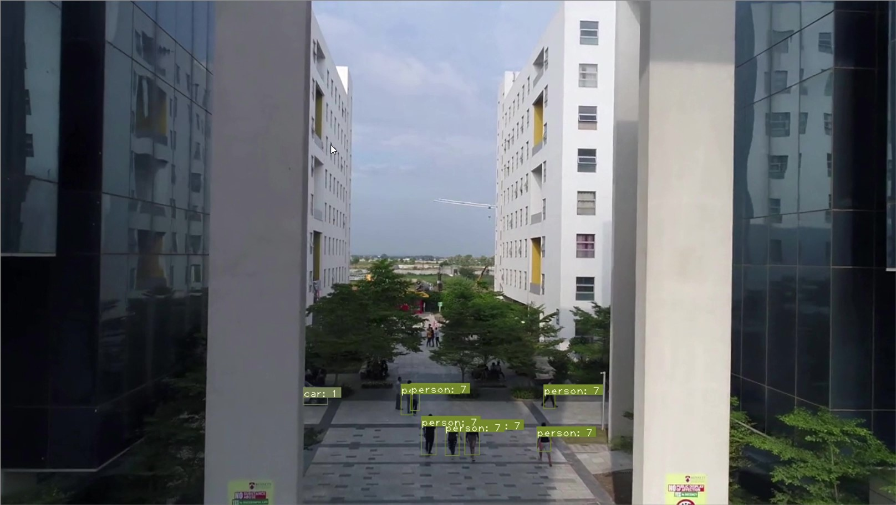
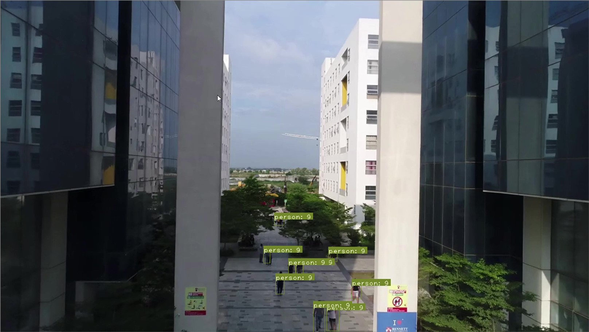
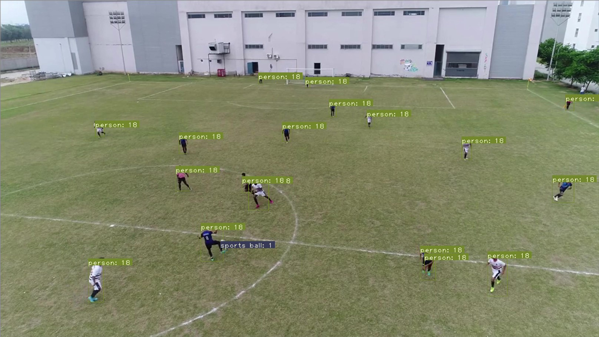
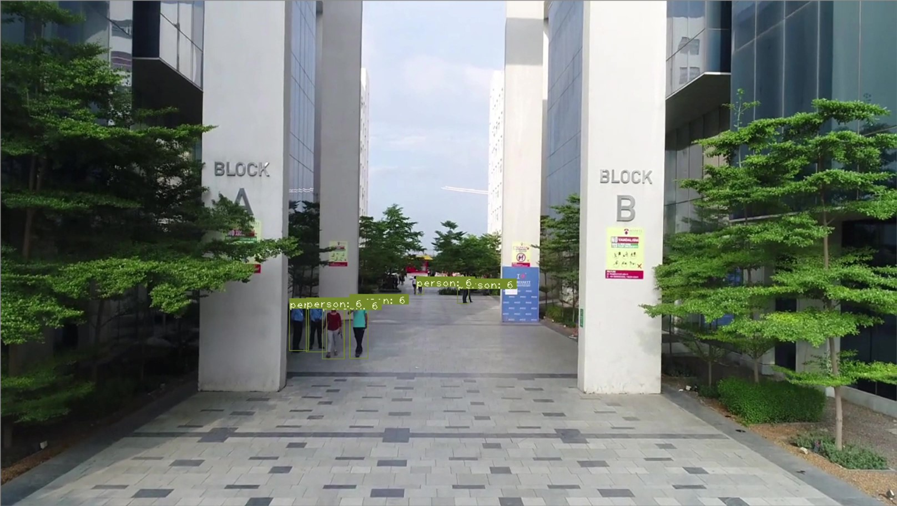

# Surveillance_Social_Distancing_Drone_yolov3_master

https://github.com/abhibothera/Surveillance_Social_Distancing_Drone_yolov3_master


Object counter is a toolkit that uses YOLO V3(you only look once version 3) algorithm. It makes an object detection on images/videos and count the number of objects present in the video coming from the camera on the drone.


Video sample of the drone footage is uploaded here : https://www.youtube.com/watch?v=piEvitlra1Y







This toolkit allow you to make predictions using pre-trained weights or train the network in your own dataset for making predictions.
if you have to count a lot of objects daily like goods you can use this toolkit to count for your in less than second.

****Requirements****


 - [Python 3.*](https://www.python.org/)
 - [Numpy](http://www.numpy.org/)
 - [OpenCV](https://opencv.org/)
 - [Pytorch](https://pytorch.org/)

It is used to:

 - make predictions on videos


 ## Setup For Predictions
 After download and extract the repository

 #### Weights
Add your weights in weights directory, or download coco weights for yolov3 of tiny yolo
by running these commands
yolo -> `$ sh weights/download_weights.sh`
tiny yolo -> `$ sh weights/download_weights_tiny.sh`

#### Configurations
Add your configuration file for your model in config directory, or use yolov3 of tiny yolo configurations models files


## Videos
`video.py` is the script that is responsible for managing predictions on videos
```
usage: video.py [-h] [--bs BS] [--confidence CONFIDENCE]
                [--nms_thresh NMS_THRESH] [--config CONFIGFILE]
                [--weights WEIGHTSFILE] [--outputs OUTPUTS] [--reso RESO]
                [--video VIDEOFILE] [--cam CAMERA]

YOLO v3 Detection Module

optional arguments:
  -h, --help            show this help message and exit
  --confidence CONFIDENCE
                        Object Confidence to filter predictions
  --nms_thresh NMS_THRESH
                        NMS Threshhold
  --config CONFIGFILE   Config file
  --weights WEIGHTSFILE
                        weightsfile
  --outputs OUTPUTS     Image / Directory to store detections
  --reso RESO           Input resolution of the network. Increase to increase
                        accuracy. Decrease to increase speed
  --video VIDEOFILE     Video file to run detection on
  --cam CAMERA          use camera to make detections

```


 ## Credits
 - [Object-Counter-YOLOV3](https://github.com/DiaaZiada/Object-Counter-YOLOV3)
 - [YOLO v3 tutorial from scratch](https://github.com/ayooshkathuria/YOLO_v3_tutorial_from_scratch)
 - [PyTorch YOLOv3](https://github.com/eriklindernoren/PyTorch-YOLOv3)
